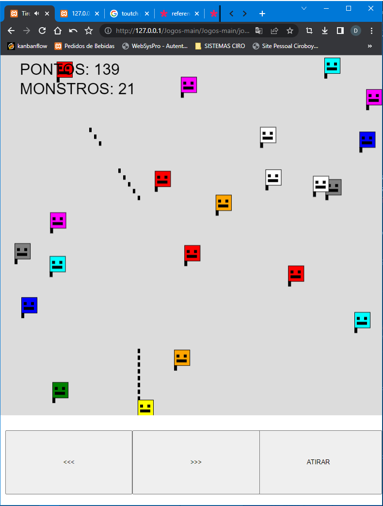

# tirolildo
Jogo simples estilo shot-up, criado enquando estudava um pouco sobre canvas e a biblioteca P5JS

Comandos:

ESPAÇO - Atirar
ASWD - Teclas de movimentação

Link: [http://portifolios.com/ciro/tirolildo/](https://gerardao.com.br/ciro/tirolildo/)

HTML + Javascript + PHP + Lib P5js

